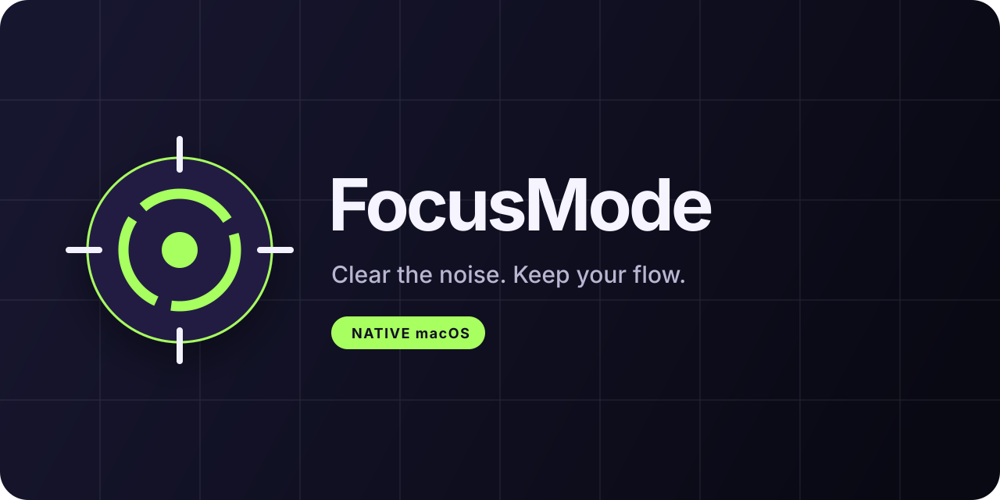

<div align="center">
  

  <p><strong>A tiny native macOS menu-bar app that clears your workspace and restores it when you are ready.</strong></p>

  [](#requirements)
  [](Package.swift)
  [](../../actions/workflows/ci.yml)
  [](LICENSE)
</div>

## Why FocusMode?

A busy desktop quietly consumes memory, battery, and attention. FocusMode politely closes the apps you do not need, remembers the ones that actually quit, and brings them back later. It is particularly useful before deep-work sessions, local AI workloads, builds, streaming, or anything else that deserves the whole machine.

No accounts. No analytics. No background service. Everything stays on your Mac.

## Highlights

- **One-click focus sessions**: close eligible apps and save a restorable session.
- **Reliable restoration**: reopen only the apps that accepted the quit request.
- **Reusable profiles**: keep a different set of apps open for coding, writing, meetings, or local AI.
- **Quick cleanup**: close apps without retaining a session when you want a clean slate.
- **Safe by design**: uses the standard macOS quit request and never force-quits an app.
- **System-aware**: ignores background agents and protects Finder, security tools, and configured essentials.
- **Native and lightweight**: built with SwiftUI and AppKit, with no third-party dependencies.
- **Localized**: English, Italian, Spanish, French, German, Portuguese, Simplified Chinese, Japanese, and Korean.

## Screenshots

<p align="center">
  
  
</p>

## How It Works

1. Choose a profile from the menu bar.
2. Select **Close and save session**.
3. FocusMode asks regular user-interface apps to quit, excluding protected and profile-listed apps.
4. Select **Disable and restore** when you are done to reopen the saved apps.

Unsaved documents remain protected by each app's normal macOS confirmation flow. If an app declines to quit, FocusMode does not add it to the restore session.

## Requirements

- macOS 14 Sonoma or newer
- Xcode 16+ or the Swift 6 toolchain
- Apple Silicon or Intel Mac

## Build From Source

Clone the repository using GitHub's **Code** button, then run:

```zsh
cd FocusMode
zsh build-app.sh
```

The script builds a release executable, creates an ad-hoc signed `FocusMode.app`, and launches it. The app is created in the repository root and ignored by Git.

Use `zsh build-app.sh --no-open` to create the bundle without launching it.

For a development build without creating an app bundle:

```zsh
swift build
swift run FocusMode
```

Because local builds are not notarized, macOS may ask for confirmation the first time you open the app.

## Create A Release

Push a version tag matching `v*` to build the app and publish a GitHub Release automatically:

```zsh
git tag v1.0.0
git push origin v1.0.0
```

The [release workflow](.github/workflows/release.yml) attaches `FocusMode.zip` and its SHA-256 checksum to the release. It can also be run manually from **Actions > Release > Run workflow** to test the build without publishing a GitHub Release.

Release bundles are ad-hoc signed but not Apple-notarized, so Gatekeeper may require user confirmation.

## Profiles And Exclusions

Open **Settings** and add app names or bundle identifiers separated by commas. Matching is case-insensitive. The selected profile is applied when the next focus session starts.

FocusMode protects these apps by default:

| Category | Apps |
| --- | --- |
| Workspace | Finder, Firefox, kitty, Microsoft Teams |
| Local AI | Ollama, omlx, LM Studio |
| Security | ESET Endpoint Security, FortiClient |

Only apps with a regular user interface are considered for closure. macOS services and background agents are ignored.

## Privacy And Safety

- FocusMode performs all work locally.
- It has no telemetry, account system, network client, or cloud backend.
- It sends normal termination requests through macOS and never force-quits processes.
- Saved sessions and profiles are stored in the app's local `UserDefaults` domain.
- **Clean up everything** deliberately discards any previously saved restore session.

## Project Structure

```text
FocusMode/
├── App/                         # macOS bundle metadata
├── Sources/FocusMode/           # SwiftUI app and session manager
│   └── Resources/               # Localized strings
├── assets/                      # Brand artwork
├── .github/                     # CI and contribution templates
└── build-app.sh                 # Release bundle builder
```

## Contributing

Contributions are welcome. Read [CONTRIBUTING.md](CONTRIBUTING.md) before opening a pull request. For help and usage questions, see [SUPPORT.md](SUPPORT.md); report vulnerabilities privately according to [SECURITY.md](SECURITY.md).

## Roadmap

- Signed and notarized GitHub releases
- App picker for profile exclusions
- Optional keyboard shortcut
- Session history and recovery controls

Have another idea? Start a [feature request](../../issues/new?template=feature_request.yml).

## License

FocusMode is available under the [MIT License](LICENSE).

<div align="center">
  <sub>Clear the noise. Keep your flow.</sub>
</div>
